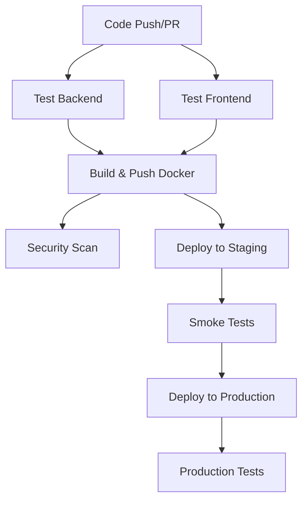

# Task 4: CI/CD Pipeline with GitHub Actions

## Overview
This project implements a comprehensive CI/CD pipeline using GitHub Actions for the Task Management System. The pipeline includes automated testing, building, containerization, security scanning, and deployment to Kubernetes clusters.

## Features
- ✅ Multi-stage CI/CD pipeline
- ✅ Automated testing (Backend & Frontend)
- ✅ Docker image building and pushing
- ✅ Security vulnerability scanning
- ✅ Multi-environment deployment (Staging & Production)
- ✅ Kubernetes deployment automation
- ✅ Smoke testing and validation
- ✅ Artifact management

## Pipeline Architecture



## Pipeline Stages

### 1. Continuous Integration (CI)
- **Backend Testing**: Java unit tests with MongoDB
- **Frontend Testing**: React component tests with coverage
- **Code Quality**: Linting and formatting checks
- **Security Scanning**: Vulnerability assessment

### 2. Continuous Deployment (CD)
- **Docker Build**: Multi-stage container builds
- **Registry Push**: GitHub Container Registry
- **Staging Deployment**: Automated staging environment
- **Production Deployment**: Manual approval workflow
- **Smoke Testing**: Automated health checks

## Workflow Configuration

### Trigger Events
```yaml
on:
  push:
    branches: [ main, develop ]
  pull_request:
    branches: [ main ]
```

### Environment Variables
```yaml
env:
  REGISTRY: ghcr.io
  IMAGE_NAME: ${{ github.repository }}
```

## Detailed Pipeline Steps

### 1. Backend Testing
```yaml
test-backend:
  runs-on: ubuntu-latest
  services:
    mongodb:
      image: mongo:7.0
      env:
        MONGO_INITDB_ROOT_USERNAME: admin
        MONGO_INITDB_ROOT_PASSWORD: password123
      ports:
        - 27017:27017
  steps:
    - name: Set up JDK 17
      uses: actions/setup-java@v4
      with:
        java-version: '17'
        distribution: 'temurin'
    - name: Cache Maven dependencies
      uses: actions/cache@v3
    - name: Run tests
      run: ./mvnw clean test
```

### 2. Frontend Testing
```yaml
test-frontend:
  runs-on: ubuntu-latest
  steps:
    - name: Set up Node.js
      uses: actions/setup-node@v4
      with:
        node-version: '18'
        cache: 'npm'
    - name: Install dependencies
      run: npm ci
    - name: Run tests
      run: npm test -- --coverage --watchAll=false
    - name: Build application
      run: npm run build
```

### 3. Docker Build & Push
```yaml
build-and-push:
  needs: [test-backend, test-frontend]
  runs-on: ubuntu-latest
  if: github.event_name == 'push' && github.ref == 'refs/heads/main'
  steps:
    - name: Log in to Container Registry
      uses: docker/login-action@v3
      with:
        registry: ${{ env.REGISTRY }}
        username: ${{ github.actor }}
        password: ${{ secrets.GITHUB_TOKEN }}
    - name: Extract metadata
      uses: docker/metadata-action@v5
    - name: Build and push Docker image
      uses: docker/build-push-action@v5
      with:
        context: ./task1-java-backend
        push: true
        tags: ${{ steps.meta.outputs.tags }}
```

### 4. Security Scanning
```yaml
security-scan:
  runs-on: ubuntu-latest
  steps:
    - name: Run Trivy vulnerability scanner
      uses: aquasecurity/trivy-action@master
      with:
        scan-type: 'fs'
        scan-ref: '.'
        format: 'sarif'
        output: 'trivy-results.sarif'
    - name: Upload Trivy scan results
      uses: github/codeql-action/upload-sarif@v2
```

### 5. Staging Deployment
```yaml
deploy-staging:
  needs: build-and-push
  runs-on: ubuntu-latest
  environment: staging
  steps:
    - name: Set up kubectl
      uses: azure/setup-kubectl@v3
    - name: Deploy to staging
      run: |
        kubectl set image deployment/task-management-app \
          task-management-app=${{ env.REGISTRY }}/${{ env.IMAGE_NAME }}:latest \
          -n task-management
        kubectl rollout status deployment/task-management-app -n task-management
```

### 6. Production Deployment
```yaml
deploy-production:
  needs: [build-and-push, deploy-staging]
  runs-on: ubuntu-latest
  environment: production
  steps:
    - name: Deploy to production
      run: |
        kubectl set image deployment/task-management-app \
          task-management-app=${{ env.REGISTRY }}/${{ env.IMAGE_NAME }}:latest \
          -n task-management
        kubectl rollout status deployment/task-management-app -n task-management
```

## Required Secrets

### GitHub Secrets Configuration
```bash
# Kubernetes Configuration
KUBE_CONFIG=<base64-encoded-kubeconfig>
KUBE_CONTEXT=<staging-cluster-context>
KUBE_CONFIG_PROD=<base64-encoded-production-kubeconfig>
KUBE_CONTEXT_PROD=<production-cluster-context>

# Container Registry (Optional - uses GITHUB_TOKEN by default)
DOCKER_USERNAME=<registry-username>
DOCKER_PASSWORD=<registry-password>
```

### Environment Setup
```bash
# Staging Environment
- name: staging
  protection_rules:
    - required_reviewers: 1
    - wait_timer: 0

# Production Environment  
- name: production
  protection_rules:
    - required_reviewers: 2
    - wait_timer: 0
    - prevent_self_review: true
```

## Pipeline Features

### 1. Parallel Execution
- Backend and frontend tests run in parallel
- Optimized execution time
- Independent failure handling

### 2. Conditional Deployment
- Only deploy on main branch pushes
- Environment-specific configurations
- Manual approval for production

### 3. Artifact Management

## Quickstart (GitHub Actions)

1) Place workflow at repo root

The workflow must live at `.github/workflows/ci-cd.yml` (already added).

2) Create required GitHub Secrets (Repo → Settings → Secrets and variables → Actions)

```
KUBE_CONFIG          # base64-encoded kubeconfig for staging
KUBE_CONTEXT         # kubectl context name for staging cluster
KUBE_CONFIG_PROD     # base64-encoded kubeconfig for production
KUBE_CONTEXT_PROD    # kubectl context name for production cluster
```

Optional (if not using default GITHUB_TOKEN for GHCR):

```
DOCKER_USERNAME
DOCKER_PASSWORD
```

How to generate base64 kubeconfig (Linux/macOS):

```bash
cat ~/.kube/config | base64 -w 0
```

3) Ensure cluster resources exist

Apply the Kubernetes manifests in `task1-java-backend/k8s/` at least once so the namespace, services and deployments exist:

```bash
kubectl apply -f task1-java-backend/k8s/namespace.yaml
kubectl apply -f task1-java-backend/k8s/rbac.yaml
kubectl apply -f task1-java-backend/k8s/mongodb-pv.yaml
kubectl apply -f task1-java-backend/k8s/mongodb-deployment.yaml
kubectl apply -f task1-java-backend/k8s/app-deployment.yaml
```

4) Push to run

- Push to `develop` or open a PR → CI runs (tests, build, scan)
- Push to `main` → CI + staging deploy + smoke test; then production deploy (requires environment approval)

## What gets built

- Backend (Task 1): Maven tests and packaged JAR
- Frontend (Task 3): TypeScript build
- Docker image: `ghcr.io/<owner>/<repo>:latest` from `task1-java-backend/Dockerfile`

## How deployment works

- Updates image of `deployment/task-management-app` in namespace `task-management`:

```bash
kubectl set image deployment/task-management-app \
  task-management-app=ghcr.io/<owner>/<repo>:latest \
  -n task-management
```

- Waits for rollout and runs a health-check against `/tasks/health`.
- Docker images tagged with commit SHA
- Frontend build artifacts
- Test reports and coverage

### 4. Rollback Capability
```bash
# Manual rollback
kubectl rollout undo deployment/task-management-app -n task-management

# Rollback to specific revision
kubectl rollout undo deployment/task-management-app --to-revision=2 -n task-management
```

## Testing Strategy

### 1. Unit Tests
- Backend: Maven Surefire tests
- Frontend: Jest/React Testing Library
- Coverage reporting

### 2. Integration Tests
- API endpoint testing
- Database integration
- Cross-component testing

### 3. Smoke Tests
```bash
# Health check
curl -f http://$SERVICE_URL:8080/tasks/health

# API functionality
curl -f http://$SERVICE_URL:8080/tasks

# Database connectivity
kubectl exec -it <pod> -n task-management -- curl localhost:8080/tasks/health
```

### 4. Security Tests
- Vulnerability scanning with Trivy
- Dependency audit
- Container security assessment

## Monitoring & Observability

### 1. Pipeline Monitoring
- GitHub Actions dashboard
- Build status notifications
- Deployment history

### 2. Application Monitoring
- Health check endpoints
- Log aggregation
- Performance metrics

### 3. Alerting
- Failed deployment notifications
- Security vulnerability alerts
- Performance degradation warnings

## Deployment Strategies

### 1. Rolling Updates
```yaml
strategy:
  type: RollingUpdate
  rollingUpdate:
    maxUnavailable: 1
    maxSurge: 1
```

### 2. Blue-Green Deployment
```bash
# Create blue environment
kubectl apply -f k8s/blue-deployment.yaml

# Switch traffic
kubectl patch service task-management-service -p '{"spec":{"selector":{"version":"blue"}}}'
```

### 3. Canary Deployment
```yaml
apiVersion: argoproj.io/v1alpha1
kind: Rollout
metadata:
  name: task-management-rollout
spec:
  strategy:
    canary:
      steps:
      - setWeight: 20
      - pause: {duration: 10m}
      - setWeight: 40
      - pause: {duration: 10m}
      - setWeight: 60
      - pause: {duration: 10m}
```

## Best Practices

### 1. Security
- Least privilege access
- Secret management
- Container scanning
- Network policies

### 2. Performance
- Parallel job execution
- Caching dependencies
- Optimized Docker layers
- Resource limits

### 3. Reliability
- Health checks
- Rollback procedures
- Environment parity
- Testing automation

### 4. Maintainability
- Clear documentation
- Consistent naming
- Modular workflows
- Error handling

## Troubleshooting

### Common Issues

1. **Build Failures**
   ```bash
   # Check logs
   gh run view --log
   
   # Retry failed jobs
   gh run rerun <run-id>
   ```

2. **Deployment Issues**
   ```bash
   # Check pod status
   kubectl get pods -n task-management
   
   # Check events
   kubectl get events -n task-management --sort-by='.lastTimestamp'
   ```

3. **Secret Issues**
   ```bash
   # Verify secrets
   gh secret list
   
   # Update secrets
   gh secret set KUBE_CONFIG --body "$(cat kubeconfig | base64)"
   ```

## Local Development

### Run Pipeline Locally
```bash
# Install act
npm install -g @nektos/act

# Run workflow locally
act -W .github/workflows/ci-cd.yml

# Run specific job
act -j test-backend
```

### Test Docker Build
```bash
# Build locally
docker build -t task-management-api:local ./task1-java-backend

# Test container
docker run -p 8080:8080 task-management-api:local
```

## Performance Metrics

### Pipeline Duration
- Backend tests: ~3-5 minutes
- Frontend tests: ~2-4 minutes
- Docker build: ~2-3 minutes
- Deployment: ~1-2 minutes
- **Total**: ~8-14 minutes

### Resource Usage
- CPU: 2 cores per job
- Memory: 4GB per job
- Storage: 10GB for artifacts

## Future Enhancements

### 1. Advanced Features
- Multi-arch builds
- Performance testing
- Load testing
- Chaos engineering

### 2. Integration
- Slack notifications
- JIRA integration
- SonarQube analysis
- Prometheus monitoring

### 3. Optimization
- Parallel deployments
- Incremental builds
- Smart caching
- Resource optimization

## Author
Kaiburr Assessment - Task 4  
Date: 2025

## Screenshots

*Note: Screenshots would be included here showing:*
- *GitHub Actions workflow dashboard*
- *Pipeline execution progress*
- *Test results and coverage reports*
- *Docker build logs*
- *Security scan results*
- *Deployment status in Kubernetes*
- *Smoke test results*
